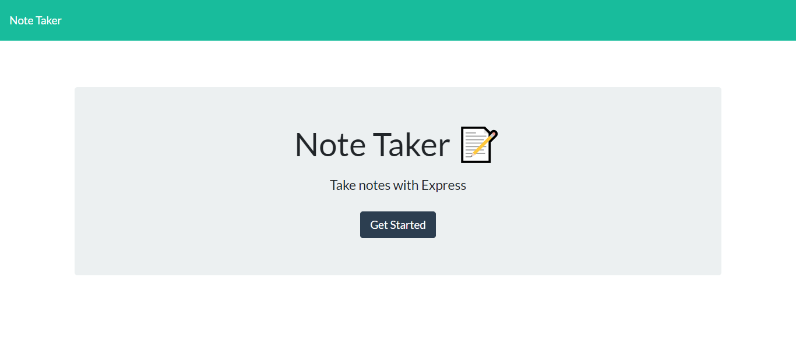
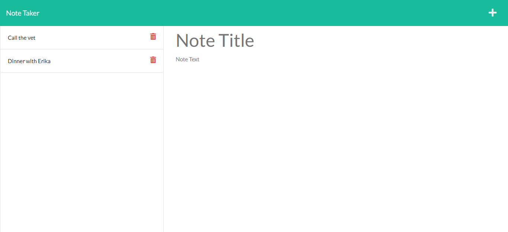

# Note Taker
Bootcamp Homework #11

## Description 
I have created a command line application that can be used to write and save notes. The user starts by clicking on the "Get Started" button and then is taken to a second page where they can choose to look at an existing note, delete a note, and add a new note. 
    
## Table of Contents

- [Installation](#installation)
- [Usage](#usage)
- [License](#license)
- [Contributions](#contributions)
- [Link](#link) 
- [Technologies](#technologies)
- [Questions](#questions)

## Installation
This application requires Node and Express, therefore users should run "npm install" in their command line prior to use. 

## Usage
Here is a screen shot of the landing page for the app:

Here is a screen shot of the notes page for the app:

## License
This project licensed under the [MIT License](https://opensource.org/licenses/MIT).

## Contributions
Please contact me at <ljhofer@gmail.com> to discuss contributions.

## Link
[Link to deployed on Heroku.](https://note-taker-ljhofer.herokuapp.com/notes)

[Link to project's GitHub repo.](https://github.com/ljhofer/note-taker)

## Technologies
The program uses HTML, CSS, Bootstrap, JavaScript, Node, Express 

## Questions
Please email any questions to <ljhofer@gmail.com> or reference my [GitHub profile](https://github.com/ljhofer). 

