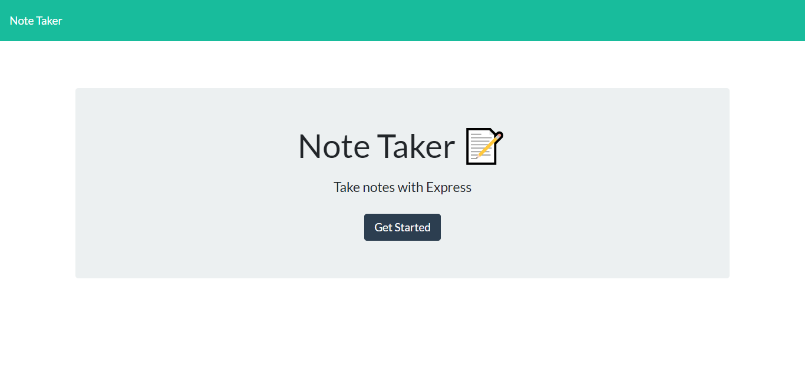

# Note Taker
Bootcamp Homework #11

Bootcamp Homework #10

## Description 
I have created a command line application that can be used to write and save notes. The uses starts by clicking on the "Get Started" button and then is taken to a second page where the can choose to look at an existing note or add a new note. 
<!--Add in here once we get the delete function working  -->
    
## Table of Contents

- [Installation](#installation)
- [Usage](#usage)
- [License](#license)
- [Contributions](#contributions)
- [Link](#link) 
- [Questions](#questions)

## Installation
This application requires Node and users should run "npm install" in their command line prior to use. 

## Usage
Here is a screen shot of the landing page for the app:

<!-- Add in a second screen shot -->

## License
This project licensed under the [MIT License](https://opensource.org/licenses/MIT).

## Contributions
Please contact me at <ljhofer@gmail.com> to discuss contributions.

## Link
<!-- Link to Heroku -->

## Questions
Please email any questions to <ljhofer@gmail.com> or reference my [GitHub profile](https://github.com/ljhofer). 

